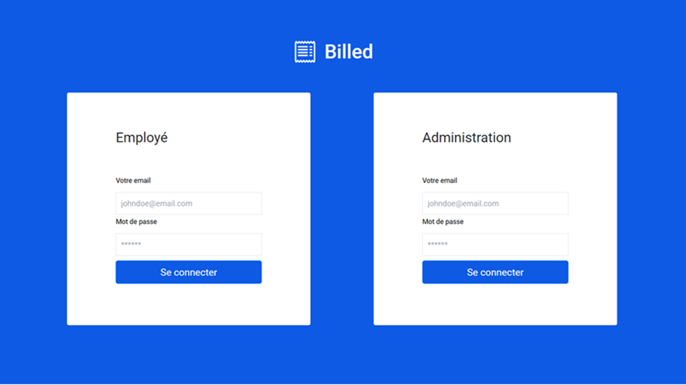

# Billed

    Projet fictif de formation n°06/11 | OpenClassrooms

**Landing page**

<kbd></kbd>

**Rapport du test de couverture obtenue**

<kbd></kbd>

> PROBLEMATIQUE

L'application web comporte des erreurs (majeures et mineures) sur le parcours employé qui doivent être analysées et déboguées.

> BESOIN

Tester et débugger pour fiabiliser et améliorer le parcours employé.

## Livrables

- [x] Correction des erreurs détectées sur les parcours Employé et Administrateur
- [x] Tests unitaires
- [x] Tests d'intégration GET + POST
- [x] Tests fonctionnels : plan de tests End-to-End du parcours employé

## Ressources fournies

- [Repo du code](https://github.com/OpenClassrooms-Student-Center/Billed-app-FR)
- [Description des fonctionnalités](https://s3-eu-west-1.amazonaws.com/course.oc-static.com/projects/Front-End+V2/P7+Tests/Billed+-+Description+des+fonctionnalite%CC%81s.pdf)
- [Kanban debugs & tests to do](https://www.notion.so/a7a612fc166747e78d95aa38106a55ec?v=2a8d3553379c4366b6f66490ab8f0b90)
- [Plan de tests End-to-End du parcours Administrateur RH](https://s3-eu-west-1.amazonaws.com/course.oc-static.com/projects/Front-End+V2/P7+Tests/Billed+-+E2E+parcours+administrateur.pdf)

## Installer

### How to run the App localy

*clone the project* `$ git clone https://github.com/OpenClassrooms-Student-Center/P6-front-end-testing.git`

*go to the cloned repo* `$ cd P6-front-end-testing`

*install npm packages (described in package.json)* `$ npm install`

*install live-server to run a local server* `$ npm install -g live-server`

*launch the App* `$ live-server`

*then go to* `http://127.0.0.1:8080/`

### How to run all tests with Jest

`$ npm run test`

### How to run a single test

*install jest-cli* `$npm i -g jest-cli`
*then* 
`$jest src/__tests__/your_test_file.js`

### How to see test coverage

`http://127.0.0.1:8080/coverage/lcov-report/`

